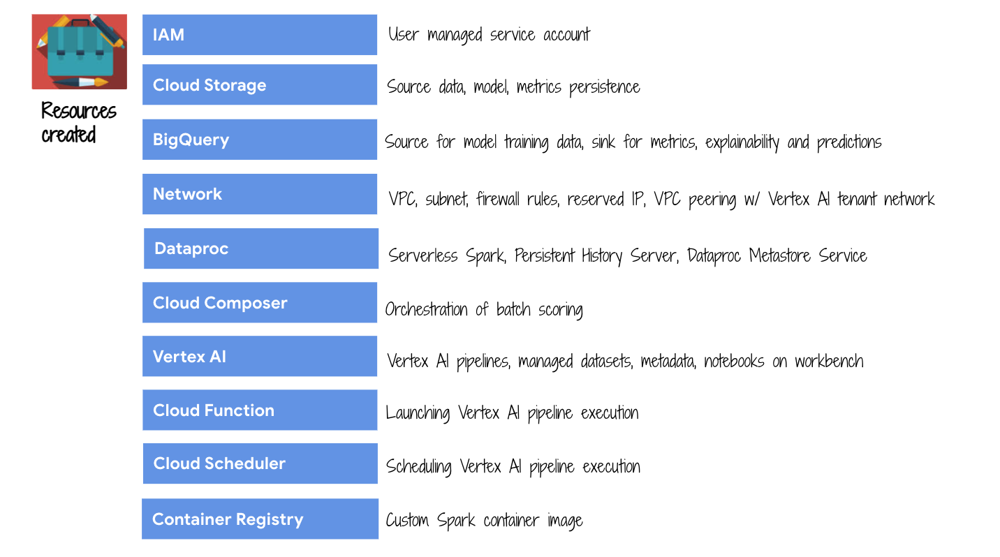

# About Module 1

This module covers environment provisioning for the workshop. This module takes ~50-60 minutes to complete. 
<br><br>
## Note:
1. **Ensure services in use in the workshop are available in the location of your preference** and modify the variables in step 2.4.1 to reflect the same.
2. Get any preview services **allow-listed**
3. Some of the organization policies many not apply for your company, modify appropriately
4. The lab is intended for each attendee to have a full environment to themselves with **shared nothing**
5. Terraform state is deliberately local for simplicity
6. Be sure to check out section 5 for glitches/nuances and workarounds.

## 1. Details about the environment that is setup by this module

   
<br><br>

   
<br><br>

   
<br><br>

## Pictorial walkthrough of services provisioned & customization
The author's environment is showcased [here](../05-lab-guide/Services-Created.md)

<hr>

## 2. Create the environment

### 2.1. Create a directory in Cloud Shell for the workshop
```
cd ~
mkdir gcp-spark-mllib-workshop
```

### 2.2. Clone the workshop git repo
```
cd ~/gcp-spark-mllib-workshop
git clone https://github.com/anagha-google/s8s-spark-mlops-lab.git
```

### 2.3. Navigate to the Terraform provisioning directory
```
cd ~/gcp-spark-mllib-workshop/s8s-spark-mlops-lab/00-env-setup
```

### 2.4. Provision the environment

#### 2.4.1. Define variables for use
Modify the below as appropriate for your deployment..e.g. region, zone etc. Be sure to use the right case for GCP region & zone.<br>
Regions and zones listing can be found [here](https://cloud.google.com/compute/docs/regions-zones)(zone has a -a/b/c as suffix to region/location).<br>
For Cloud Scheduler timezone, use the Cloud Scheduler UI and see available options for you.<br>
```
PROJECT_ID=`gcloud config list --format "value(core.project)" 2>/dev/null`
PROJECT_NBR=`gcloud projects describe $PROJECT_ID | grep projectNumber | cut -d':' -f2 |  tr -d "'" | xargs`
PROJECT_NAME=`gcloud projects describe ${PROJECT_ID} | grep name | cut -d':' -f2 | xargs`
GCP_ACCOUNT_NAME=`gcloud auth list --filter=status:ACTIVE --format="value(account)"`
ORG_ID=`gcloud organizations list --format="value(name)"`
VPC_NM=s8s-vpc-$PROJECT_NBR
SPARK_SERVERLESS_SUBNET=spark-snet
PERSISTENT_HISTORY_SERVER_NM=s8s-sphs-${PROJECT_NBR}
UMSA_FQN=s8s-lab-sa@$PROJECT_ID.iam.gserviceaccount.com
DATA_BUCKET=s8s_data_bucket-${PROJECT_NBR}
CODE_BUCKET=s8s_code_bucket-${PROJECT_NBR}
MODEL_BUCKET=s8s_model_bucket-${PROJECT_NBR}
BQ_CONNECTOR_JAR_GCS_URI="gs://spark-lib/bigquery/spark-bigquery-with-dependencies_2.12-0.22.2.jar"
CLOUD_COMPOSER_IMG_VERSION="composer-2.0.11-airflow-2.2.3"
SPARK_CUSTOM_CONTAINER_IMAGE_TAG="1.0.0"
YOUR_GCP_REGION="us-central1"
YOUR_GCP_ZONE="us-central1-a"
YOUR_GCP_MULTI_REGION="US"
CLOUD_SCHEDULER_TIME_ZONE="America/Chicago"

echo "PROJECT_ID=$PROJECT_ID"
echo "PROJECT_NBR=$PROJECT_NBR"
echo "PROJECT_NAME=$PROJECT_NAME"
echo "VPC_NM=$VPC_NM"
echo "PERSISTENT_HISTORY_SERVER_NM=$PERSISTENT_HISTORY_SERVER_NM"
echo "UMSA_FQN=$UMSA_FQN"
echo "DATA_BUCKET=$DATA_BUCKET"
echo "CODE_BUCKET=$CODE_BUCKET"
```

### 2.4.2. Initialize Terraform
Needs to run in cloud shell from ~/gcp-spark-mllib-workshop/s8s-spark-mlops/00-env-setup
```
cd ~/gcp-spark-mllib-workshop/s8s-spark-mlops-lab/00-env-setup

terraform init
```

#### 2.4.3. Review the Terraform deployment plan
Needs to run in cloud shell from ~/gcp-spark-mllib-workshop/s8s-spark-mlops-lab/00-env-setup
```
cd ~/gcp-spark-mllib-workshop/s8s-spark-mlops-lab/00-env-setup

terraform plan \
  -var="project_id=${PROJECT_ID}" \
  -var="project_name=${PROJECT_NAME}" \
  -var="project_number=${PROJECT_NBR}" \
  -var="gcp_account_name=${GCP_ACCOUNT_NAME}" \
  -var="org_id=${ORG_ID}" \
  -var="cloud_composer_image_version=${CLOUD_COMPOSER_IMG_VERSION}" \
  -var="spark_container_image_tag=${SPARK_CUSTOM_CONTAINER_IMAGE_TAG}" \
  -var="gcp_region=${YOUR_GCP_REGION}" \
  -var="gcp_zone=${YOUR_GCP_ZONE}" \
  -var="gcp_multi_region=${YOUR_GCP_MULTI_REGION}" \
  -var="bq_connector_jar_gcs_uri=${BQ_CONNECTOR_JAR_GCS_URI}" \
  -var="cloud_scheduler_time_zone=${CLOUD_SCHEDULER_TIME_ZONE}"
```

#### 2.4.4. Provision the environment
Needs to run in cloud shell from ~/gcp-spark-mllib-workshop/s8s-spark-mlops/00-env-setup
```
cd ~/gcp-spark-mllib-workshop/s8s-spark-mlops-lab/00-env-setup

terraform apply \
  -var="project_id=${PROJECT_ID}" \
  -var="project_name=${PROJECT_NAME}" \
  -var="project_number=${PROJECT_NBR}" \
  -var="gcp_account_name=${GCP_ACCOUNT_NAME}" \
  -var="org_id=${ORG_ID}"  \
  -var="cloud_composer_image_version=${CLOUD_COMPOSER_IMG_VERSION}" \
  -var="spark_container_image_tag=${SPARK_CUSTOM_CONTAINER_IMAGE_TAG}" \
  -var="gcp_region=${YOUR_GCP_REGION}" \
  -var="gcp_zone=${YOUR_GCP_ZONE}" \
  -var="gcp_multi_region=${YOUR_GCP_MULTI_REGION}" \
  -var="bq_connector_jar_gcs_uri=${BQ_CONNECTOR_JAR_GCS_URI}" \
  -var="cloud_scheduler_time_zone=${CLOUD_SCHEDULER_TIME_ZONE}" \
  --auto-approve
```

<hr>

## 3. Validate your Terraform deployment against a pictorial overview of services provisioned & customization
Available [here](../05-lab-guide/Services-Created.md)


<hr>

## 4. Glitches/nuances to be mindful of
**4.1. Cloud Composer 2**<br>
If you edit the Terraform and run apply, Cloud Composer2 attempts to update the network and fails the deployment. <br>
Workaround: Delete Cloud Composer manually and then rerun. 10+ minutes to delete, 20 minutes to recreate -> enough for a power nap. :)

**4.2. Managed Notebook Instance on Vertex AI Workbench**<br>
Changing ownership of notebooks (uploaded to /home/jupyter via Terrafrom) from owner root to jupyter:jupyter does not work currently as part of Terraform deployment.<br>
Workaround: Clone the notebook and save.

**4.3. Persistent Spark History Server (PHS)**<br>
If you edit the Terraform and run apply, PHS gets destroyed and recreated. <br>
Workaround: Not applicable. It just takes 90 seconds or less to destroy and 90 seconds to recreate.

<hr>

## 5. Terraform How-Tos [DO NOT RUN THIS, ITS JUST FYI]

### 5.1. For selective replacement of specific services/units of deployment [DO NOT RUN THIS, ITS JUST FYI]

This is not needed...and is informational only.<br>
Needs to run in cloud shell from ~/gcp-spark-mllib-workshop/s8s-spark-mlops-lab/00-env-setup<br>
If -target does not work, try -replace
```
#terraform apply -target=google_storage_bucket_object.upload_cc2_dag_to_airflow_dag_bucket \
-var="project_id=${PROJECT_ID}" \
  -var="project_name=${PROJECT_NAME}" \
  -var="project_number=${PROJECT_NBR}" \
  -var="gcp_account_name=${GCP_ACCOUNT_NAME}" \
  -var="org_id=${ORG_ID}"  \
  -var="cloud_composer_image_version=${CLOUD_COMPOSER_IMG_VERSION}" \
  -var="spark_container_image_tag=${SPARK_CUSTOM_CONTAINER_IMAGE_TAG}" \
  -var="gcp_region=${YOUR_GCP_REGION}" \
  -var="gcp_zone=${YOUR_GCP_ZONE}" \
  -var="gcp_multi_region=${YOUR_GCP_MULTI_REGION}" \
  -var="bq_connector_jar_gcs_uri=${BQ_CONNECTOR_JAR_GCS_URI}" \
  -var="cloud_scheduler_time_zone=${CLOUD_SCHEDULER_TIME_ZONE}" \
  --auto-approve
```

### 5.2. To destroy the deployment [DO NOT RUN THIS, ITS JUST FYI]

You can (a) shutdown the project altogether in GCP Cloud Console or (b) use Terraform to destroy. Use (b) at your own risk as its a little glitchy while (a) is guaranteed to stop the billing meter pronto.
<br>
Needs to run in cloud shell from ~/gcp-spark-mllib-workshop/s8s-spark-mlops-lab/00-env-setup
```
#terraform destroy \
  -var="project_id=${PROJECT_ID}" \
  -var="project_name=${PROJECT_NAME}" \
  -var="project_number=${PROJECT_NBR}" \
  -var="gcp_account_name=${GCP_ACCOUNT_NAME}" \
  -var="org_id=${ORG_ID}" \
  -var="cloud_composer_image_version=${CLOUD_COMPOSER_IMG_VERSION}" \
  -var="spark_container_image_tag=${SPARK_CUSTOM_CONTAINER_IMAGE_TAG}" \
  -var="gcp_region=${YOUR_GCP_REGION}" \
  -var="gcp_zone=${YOUR_GCP_ZONE}" \
  -var="gcp_multi_region=${YOUR_GCP_MULTI_REGION}" \
  -var="bq_connector_jar_gcs_uri=${BQ_CONNECTOR_JAR_GCS_URI}" \
  -var="cloud_scheduler_time_zone=${CLOUD_SCHEDULER_TIME_ZONE}" \
  --auto-approve
 ```

<hr>

## 6. What's in the next module
In the [next module](../05-lab-guide/Module-02-Spark-IDE-on-GCP.md), we will learn how to use Serverless Spark interactive notebooks for machine learning model development with Spark MLLib on Dataproc Serverless Spark.

<hr>
