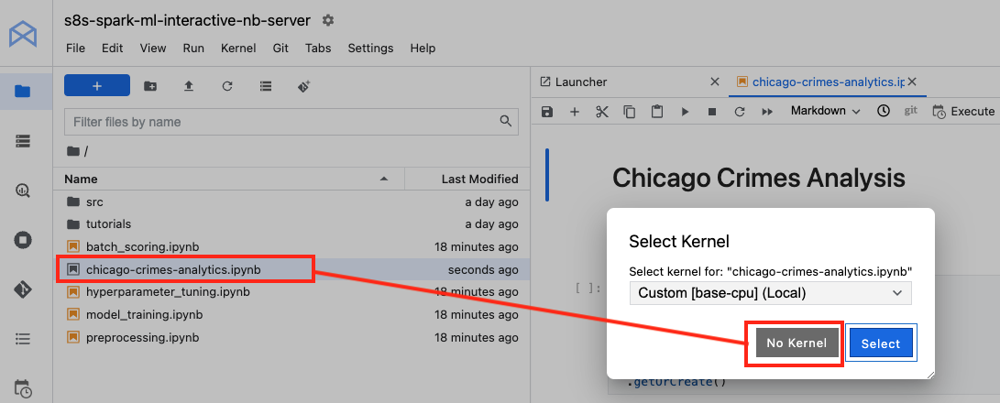
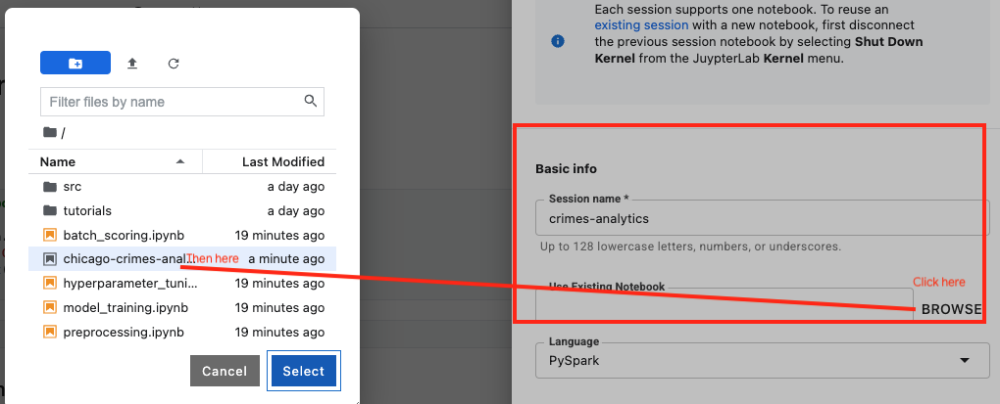
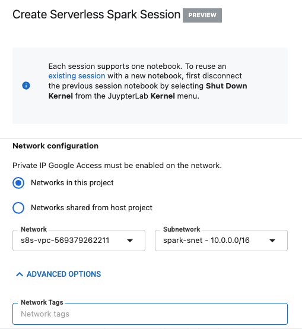
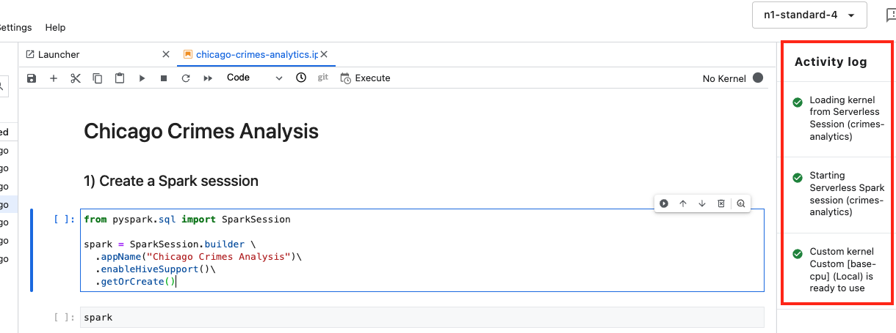
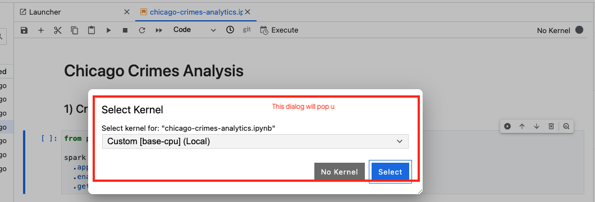
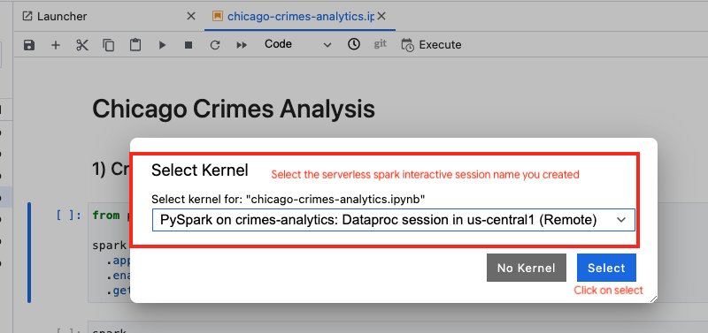
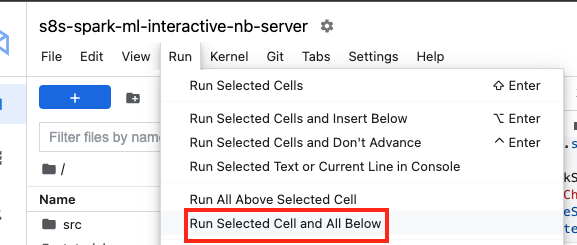
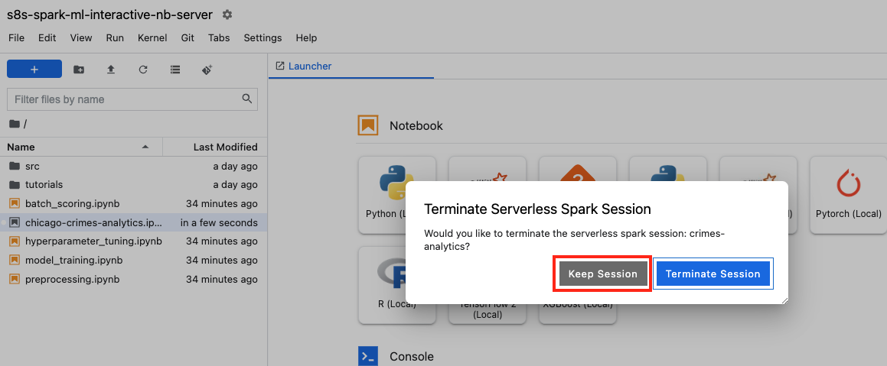

# About

This module covers how to use Vertex AI Workbench's "Managed Notebook Instance" for authoring Spark code in an interactive manner with Dataproc Serverless Spark interactive sessions. Understanding creation of serveless Spark interactive sessions and notebook nuances is crucial for the next module where you will run actual machine learning experiments.

<hr>

### 1. About Dataproc Serverless Spark Interactive (README FIRST)
Dataproc Serverless Spark Interactive is serverless Dataproc with managed autoscaling private infrastructure for interactive Spark code authoring via a Jupyter notebook hosted on Vertex AI Managed Notebook instance. The following are steps to author Spark code in an interactive fashion in a Spark notebook on GCP.<br>

*This is a listing FYI, further in this module, there is a step by step pictorial walk through.*

#### 1a. Create the notebook instance
1. Create a Vertex AI Workbench managed notebook instance (one time)
2. Open JupyterLab in #1

#### 1b. Create the Serverless Spark Interactive session in Jupyterlab
4. Click on launcher
5. Click on Serverless Spark
6. Create an interactive session (needs allowlisting if not GA)
7. Enter a session name
8. Key in your User Managed Service Account
9. Ensure the correct network settings are pre-populated
10. Select the metastore if applicable
11. Select the Persistent Spark History Server
12. Enter the fully qualified path for the Spark custom container image
13. Enter the package name for Spark BQ connector jar in the properties dialog
14. Click submit
15. You will see a kernel appear, pick the spark interactive session you created and hit select. And start authroing Spark code.

#### 1c. What about switching notebooks?
A spark interactive session can be attached to **just one notebook at any point of time**, by design.<br> 
To work on a diffferent notebook, 
1. In the left hand navigation bar, right click on the notboook with interactive session attached to it, and click on shut down kernel
2. Then close the notebook 
3. You will see a dialog asking if you want to keep or terminate the session - select "keep session"
4. Open the next notebook
5. Click on the kernel picker on the right top of the open notebook and select the interactive session you created.
6. You can then start working with Spark in the notebook

<hr>

### 2. The exercise
We will analyze Chicago crimes in this lab, based off of the Chicago Crimes public dataset in BigQuery. Vertex AI workbench is pre-created along with upload of a pre-created Chicago Crimes Analytics notebook into the managed notebook instance's /home/jupyter directory, ready for use. 

**Goals:**
1. Understand how to create and attach a Dataproc Serverless Spark interactive session to your Jupyter notebook  
2. Learn how to switch the Dataproc Serverless Spark interactive session created, between notebooks
3. Learn to navigate Dataproc UI for the Serverless Spark interactive session 
4. Browse the Spark UI of the persistent Spark History Server, for the Serverless Spark interactive session 
5. Learn how to anayze data in BigQuery using the BigQuery Spark connector.

**Pre-requisite:**
1. Ensure that any preview features are allow-listed by product engineering, ahead of time
2. Provisioning from module 1 needs to be successfully completed

**Note:**
<br>If the notebook is not editable, make a copy and use the same.

<hr>

### 3. Varibles you will need for this module

Run the below in Cloud Shell scoped to your project. The values in these variables are needed to create the interactive Spark session.

```
PROJECT_ID=`gcloud config list --format "value(core.project)" 2>/dev/null`
PROJECT_NBR=`gcloud projects describe $PROJECT_ID | grep projectNumber | cut -d':' -f2 |  tr -d "'" | xargs`
UMSA_FQN=s8s-lab-sa@$PROJECT_ID.iam.gserviceaccount.com
SPARK_CUSTOM_CONTAINER_IMAGE_URI="gcr.io/$PROJECT_ID/customer_churn_image:1.0.0"
SPARK_BQ_CONNECTOR_PACKAGES="com.google.cloud.spark:spark-bigquery-with-dependencies_2.12:0.25.2"

echo "PROJECT_ID=$PROJECT_ID"
echo "PROJECT_NBR=$PROJECT_NBR"
echo "UMSA_FQN=$UMSA_FQN"
echo "SPARK_CUSTOM_CONTAINER_IMAGE_URI=$SPARK_CUSTOM_CONTAINER_IMAGE_URI"
echo "SPARK_BQ_CONNECTOR_PACKAGES=$SPARK_BQ_CONNECTOR_PACKAGES"
echo "spark.jars.packages=com.google.cloud.spark:spark-bigquery-with-dependencies_2.12:0.25.2"
echo " "
echo " "
```

Author's details:
```
PROJECT_ID=gcp-scalable-ml-workshop
PROJECT_NBR=xxx
UMSA_FQN=s8s-lab-sa@gcp-scalable-ml-workshop.iam.gserviceaccount.com
SPARK_CUSTOM_CONTAINER_IMAGE_URI=gcr.io/gcp-scalable-ml-workshop/customer_churn_image:1.0.0
SPARK_BQ_CONNECTOR_PACKAGES=com.google.cloud.spark:spark-bigquery-with-dependencies_2.12:0.25.2
spark.jars.packages=com.google.cloud.spark:spark-bigquery-with-dependencies_2.12:0.25.2
```

<hr>

### 4. Navigate on the Cloud Console to the Vertex AI Workbench, Managed Notebook Instance
Open JupyterLab as shown below

   
<br><br>

   
<br><br>

<hr>


### 5. Open the Chicago Crimes notebook 

   
<br><br>

<hr>

### 6. Click on "Launcher" to create an interactive Spark session 

   
<br><br>

<hr>

### 7. Key in/select from dropdown, details required
Note that the varibles run in Cloud shell have all the values you need to create the session. Copy paste where needed.

   
<br><br>


   
<br><br>


   
<br><br>


   
<br><br>


Paste the value-
```
spark.jars.packages=com.google.cloud.spark:spark-bigquery-with-dependencies_2.12:0.25.2
```


   
<br><br>


   
<br><br>

Click on "submit". In less than 2 minutes, you should see a session created.


   
<br><br>

<hr>

### 8. Ensure you have the session you created, selected in the kernel picker dropdown

   
<br><br>


<hr>

### 9. Place your cursor in the first cell, then following the instructions below, run all cells or run each cell sequentially


   
<br><br>

   
<br><br>

<hr>

### 10. Close the notebook once the excerise is completed
Save or discard changes as needed. Be sure to "keep session" though when prompted as you close the notebook.

   
<br><br>

   
<br><br>


<hr>

This concludes the module. In the next module, you will run a complete model trainng exercise with notebooks - pre-processing, model training, hyperparameter tuning, batch scoring. 


