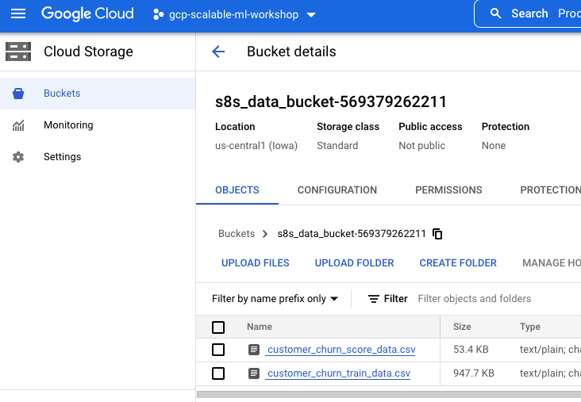
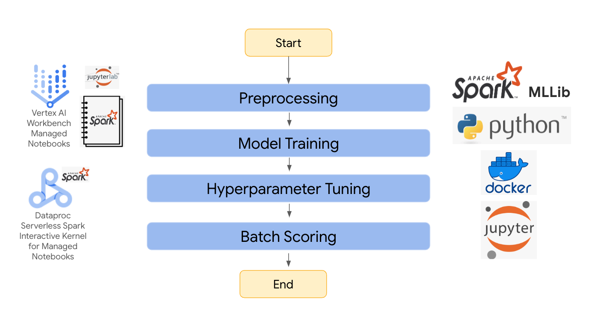
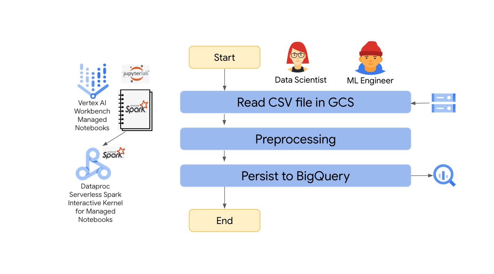

# About
The recommended GCP solution for scalable Spark based ML code interactive authoring is Serverless Spark notebooks on Vertex AI Workbench, Managed Notebooks. In this lab module, we will go through the typical data science/ML engineering work - preprocess data, train & test model, tune model, and do some scoring. Since this lab is focused on demystifying the integration, the notebooks are pre-created for you, so you can quickly understand the integration.

## 1. Use case recap
Telco Customer Churn Prediction with a Kaggle dataset and Spark MLLib, Random Forest Classifer

## 2. The data used in the experiment
Training and scoring data are available in GCS in the data bucket and the data is in CSV format.

   
  

   
  

## 3. The environment & exercises in the module
The environment for the module is Vertex AI Workbench, Managed notebook instance, custom container image for serverless Spark - pre-created as part of the Terraform deployent. We will reuse kernel created in the prior module. The following are the four exercises in the module.

   
  

## 4. Step 1: Preprocessing

### 4.1. About this step
We will read customer churn raw source data for model training, in GCS, cleanse/transform and persist to BigQuery for use in the model training step.
   
  

### 4.2. Run the pre-processing notebook
Lets ensure we have the Serverless Spark kernel created in the prior module attached to the pre-processing notebook. Follow the screenshots below-

   
  

   
  

   
  

   
  

   
  

### 4.3. Review the pre-processed data in BigQuery

### 4.4. Visit the Dataproc UI for the session

### 4.5. Visit the Spark History Server UI for the session

### 4.6. Review the notebook equivalent PySpark script in GCS for this step

## 5. Step 2: Model Training

### 5.1. Run the model training notebook

### 5.2. Review the model persisted in GCS

### 5.3. Review the model metrics persisted in GCS

### 5.4. Review the model metrics persisted in BigQuery

### 5.5. Review the model feature importance scores persisted in BigQuery

### 5.6. Review the model test results in BigQuery

### 5.7. Review the notebook equivalent PySpark script in GCS for this step

## 6. Step 3: Hyperparamater Tuning

### 6.1. Run the model tuning notebook

### 6.2. Review the model persisted in GCS

### 6.3. Review the model metrics persisted in BigQuery

### 6.4. Review the model test results in BigQuery

## 7. Step 4: Batch Scoring

This concludes the lab module where you learned to author ML experiments on interactive Spark notebooks. Proceed to the next module where you will learn to execute equivalent Spark ML PySpark scripts via command line powered by Dataproc Serverless Spark batches.
