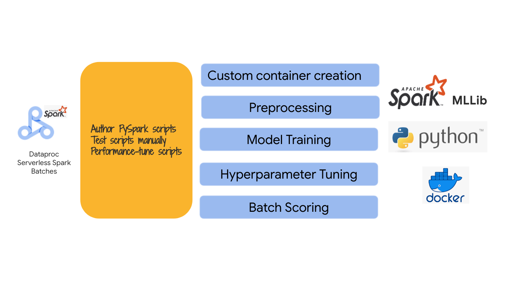

# About

In Module 3, we authored Spark ML code in interactive Spark notebooks. Vertex AI Wortbench and Dataproc do not support notebook scheduling. We therefore need to create PySpark scripts and test them out, before operationalizing into a Vertex AI pipeline. In this module, we will test pre-created PySpark scripts that are more or less a replica of the notebooks from Module 3 - the scripts accept runtime parameters.

## 1. Where we are in the model development lifecycle

   
<br><br>

## 2. The exercise
In this module we will test PySpark scripts provided as part of the lab individually in preparation of authoring a Vertex AI pipeline, in the next module, that orchestrates the execution.

   
<br><br>


## 3. Lab module environment

   
<br><br>

## 4. The exercise

   
<br><br>

## 5. The variables

The follow are variables for running via CLI on cloud shell. Paste the same into Cloud Shell authorized for your identity and scoped to the project we deployed resources into in module 1.<br>
**Note:**
1. Ensure you are in the right project and your cloud shell is configured to execute against the project.
2. Be sure to modify location variable (last variable) after ensuring all services are available in your region.
```
PROJECT_ID=`gcloud config list --format "value(core.project)" 2>/dev/null`
PROJECT_NBR=`gcloud projects describe $PROJECT_ID | grep projectNumber | cut -d':' -f2 |  tr -d "'" | xargs`
PROJECT_NAME=`gcloud projects describe ${PROJECT_ID} | grep name | cut -d':' -f2 | xargs`
GCP_ACCOUNT_NAME=`gcloud auth list --filter=status:ACTIVE --format="value(account)"`
ORG_ID=`gcloud organizations list --format="value(name)"`
VPC_NM=s8s-vpc-$PROJECT_NBR
SPARK_SERVERLESS_SUBNET=spark-snet
PERSISTENT_HISTORY_SERVER_NM=s8s-sphs-${PROJECT_NBR}
UMSA_FQN=s8s-lab-sa@$PROJECT_ID.iam.gserviceaccount.com
DATA_BUCKET=s8s_data_bucket-${PROJECT_NBR}
CODE_BUCKET=s8s_code_bucket-${PROJECT_NBR}
MODEL_BUCKET=s8s_model_bucket-${PROJECT_NBR}
CONTAINER_IMAGE_URI="gcr.io/$PROJECT_ID/customer_churn_image:1.0.0"
BQ_CONNECTOR_JAR_GS_URI="gs://spark-lib/bigquery/spark-bigquery-with-dependencies_2.12-0.22.2.jar"
BQ_CONNECTOR_PACKAGES="com.google.cloud.spark:spark-bigquery-with-dependencies_2.12:0.25.2"
PIPELINE_ID=$RANDOM
LOCATION=us-central1
```

## 6. Preprocessing

### 6.1. Execute the command in cloud shell
```
gcloud dataproc batches submit pyspark \
gs://$CODE_BUCKET/pyspark/preprocessing.py \
--py-files="gs://$CODE_BUCKET/pyspark/common_utils.py" \
--deps-bucket="gs://$CODE_BUCKET/pyspark/" \
--project $PROJECT_ID \
--region $LOCATION  \
--batch customer-churn-preprocessing-$RANDOM \
--subnet projects/$PROJECT_ID/regions/$LOCATION/subnetworks/$SPARK_SERVERLESS_SUBNET \
--history-server-cluster=projects/$PROJECT_ID/regions/$LOCATION/clusters/$PERSISTENT_HISTORY_SERVER_NM \
--service-account $UMSA_FQN \
--properties "spark.jars.packages=${BQ_CONNECTOR_PACKAGES}" \
--container-image=${CONTAINER_IMAGE_URI} \
-- --pipelineID=${PIPELINE_ID} --projectNbr=$PROJECT_NBR --projectID=$PROJECT_ID --displayPrintStatements=True
```

### 6.2. Validate completion in the Dataproc UI


### 6.3. Validate creation of the training data table in BigQuery


## Model training

```
gcloud dataproc batches submit pyspark \
gs://$CODE_BUCKET/pyspark/model_training.py \
--py-files="gs://$CODE_BUCKET/pyspark/common_utils.py" \
--deps-bucket="gs://$CODE_BUCKET/pyspark/" \
--project $PROJECT_ID \
--region $LOCATION  \
--batch customer-churn-model-training-$RANDOM \
--subnet projects/$PROJECT_ID/regions/$LOCATION/subnetworks/$SPARK_SERVERLESS_SUBNET \
--history-server-cluster=projects/$PROJECT_ID/regions/$LOCATION/clusters/$PERSISTENT_HISTORY_SERVER_NM \
--service-account $UMSA_FQN \
--properties "spark.jars.packages=${BQ_CONNECTOR_PACKAGES}" \
--container-image=${CONTAINER_IMAGE_URI} \
-- --pipelineID=${PIPELINE_ID} --projectNbr=$PROJECT_NBR --projectID=$PROJECT_ID --displayPrintStatements=True
```

## Hyperparameter tuning

```
gcloud dataproc batches submit pyspark \
gs://$CODE_BUCKET/pyspark/hyperparameter_tuning.py \
--py-files="gs://$CODE_BUCKET/pyspark/common_utils.py" \
--deps-bucket="gs://$CODE_BUCKET/pyspark/" \
--project $PROJECT_ID \
--region $LOCATION  \
--batch customer-churn-hyperparamter-tuning-$RANDOM \
--subnet projects/$PROJECT_ID/regions/$LOCATION/subnetworks/$SPARK_SERVERLESS_SUBNET \
--history-server-cluster=projects/$PROJECT_ID/regions/$LOCATION/clusters/$PERSISTENT_HISTORY_SERVER_NM \
--service-account $UMSA_FQN \
--properties "spark.jars.packages=${BQ_CONNECTOR_PACKAGES}" \
--container-image=${CONTAINER_IMAGE_URI} \
-- --pipelineID=${PIPELINE_ID} --projectNbr=$PROJECT_NBR --projectID=$PROJECT_ID --displayPrintStatements=True
```

## Batch scoring

```
gcloud dataproc batches submit pyspark \
gs://$CODE_BUCKET/pyspark/batch_scoring.py \
--py-files="gs://$CODE_BUCKET/pyspark/common_utils.py" \
--deps-bucket="gs://$CODE_BUCKET/pyspark/" \
--project $PROJECT_ID \
--region $LOCATION  \
--batch customer-churn-batch-scoring-$RANDOM \
--subnet projects/$PROJECT_ID/regions/$LOCATION/subnetworks/$SPARK_SERVERLESS_SUBNET \
--history-server-cluster=projects/$PROJECT_ID/regions/$LOCATION/clusters/$PERSISTENT_HISTORY_SERVER_NM \
--service-account $UMSA_FQN \
--properties "spark.jars.packages=${BQ_CONNECTOR_PACKAGES}" \
--container-image=${CONTAINER_IMAGE_URI} \
-- --pipelineID=${PIPELINE_ID} --projectNbr=$PROJECT_NBR --projectID=$PROJECT_ID --displayPrintStatements=True --modelVersion=${PIPELINE_ID}
```

