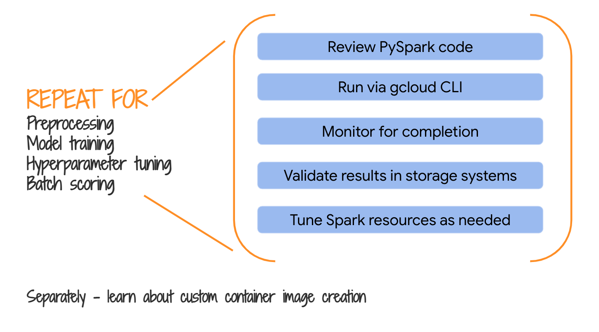
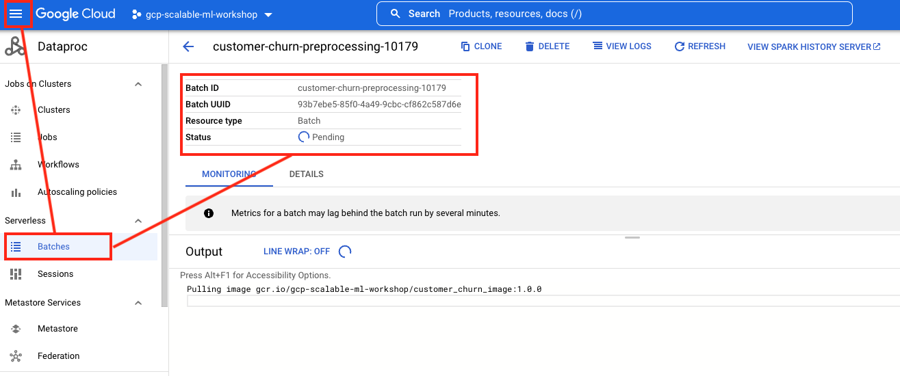
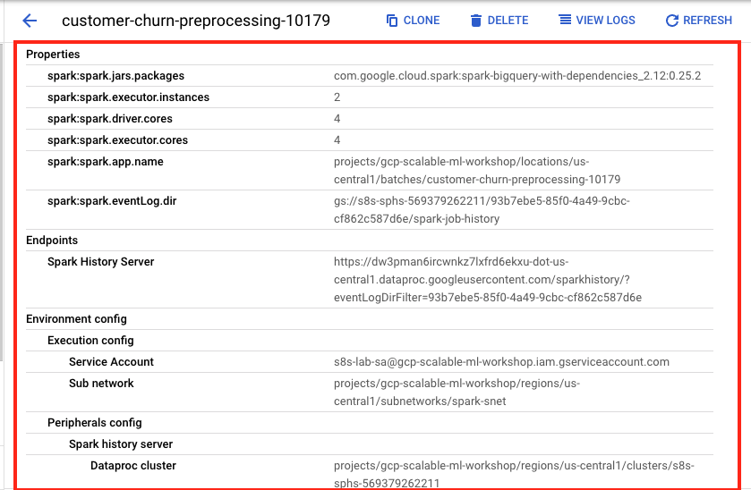
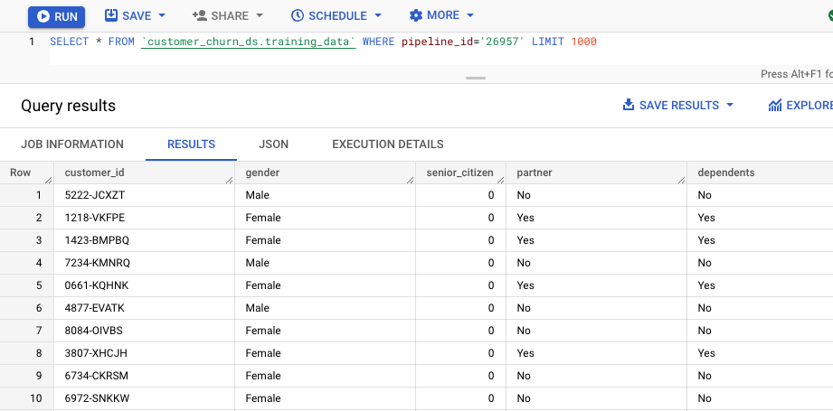
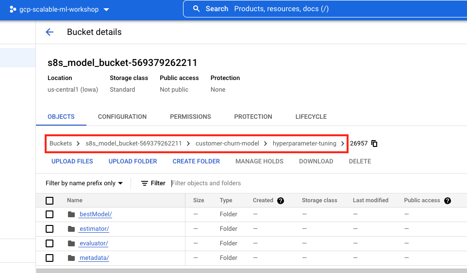

# About

In Module 3, we authored Spark ML code in interactive Spark notebooks. Vertex AI Wortbench and Dataproc do not support notebook scheduling. We therefore need to create PySpark scripts and test them out, before operationalizing into a Vertex AI pipeline. In this module, we will test pre-created PySpark scripts that are more or less a replica of the notebooks from Module 3 - the scripts accept runtime parameters.

<hr>

## 1. Where we are in the model development lifecycle

   
<br><br>

<hr>

## 2. The exercise, at a high level
In this module we will test PySpark scripts provided as part of the lab, each script individually, in preparation of authoring a Vertex AI pipeline that chains/orchestrates the ML experiment steps into a DAG, in the next module.

   
<br><br>

<hr>

## 3. The lab environment

   
<br><br>

<hr>

## 4. The exercise, for each step of the model development lifecycle

   
<br><br>

<hr>

## 5. The code

   
<br><br>

<hr>

## 6. The variables

The follow are variables for running via CLI on cloud shell. Paste the same into Cloud Shell authorized for your identity and scoped to the project we deployed resources into in module 1.<br>

**Note:**
1. Ensure you are in the **right project** and your cloud shell is configured to execute against the project.
2. Be sure to modify location (region) variable (last variable) after ensuring all services are available in **your region**.

```
PROJECT_ID=`gcloud config list --format "value(core.project)" 2>/dev/null`
PROJECT_NBR=`gcloud projects describe $PROJECT_ID | grep projectNumber | cut -d':' -f2 |  tr -d "'" | xargs`
PROJECT_NAME=`gcloud projects describe ${PROJECT_ID} | grep name | cut -d':' -f2 | xargs`
GCP_ACCOUNT_NAME=`gcloud auth list --filter=status:ACTIVE --format="value(account)"`
ORG_ID=`gcloud organizations list --format="value(name)"`
VPC_NM=s8s-vpc-$PROJECT_NBR
SPARK_SERVERLESS_SUBNET=spark-snet
PERSISTENT_HISTORY_SERVER_NM=s8s-sphs-${PROJECT_NBR}
UMSA_FQN=s8s-lab-sa@$PROJECT_ID.iam.gserviceaccount.com
DATA_BUCKET=s8s_data_bucket-${PROJECT_NBR}
CODE_BUCKET=s8s_code_bucket-${PROJECT_NBR}
MODEL_BUCKET=s8s_model_bucket-${PROJECT_NBR}
CONTAINER_IMAGE_URI="gcr.io/$PROJECT_ID/customer_churn_image:1.0.0"
BQ_CONNECTOR_JAR_GS_URI="gs://spark-lib/bigquery/spark-bigquery-with-dependencies_2.12-0.22.2.jar"
BQ_CONNECTOR_PACKAGES="com.google.cloud.spark:spark-bigquery-with-dependencies_2.12:0.25.2"
PIPELINE_ID=$RANDOM
LOCATION=us-central1
```

The PIPELINE_ID is particularly important as we will use it for traceablity/lineage.
```
echo $PIPELINE_ID
```

<hr>

## 7. Preprocessing

### 7.1. Execute the command in cloud shell
```
gcloud dataproc batches submit pyspark \
gs://$CODE_BUCKET/pyspark/preprocessing.py \
--py-files="gs://$CODE_BUCKET/pyspark/common_utils.py" \
--deps-bucket="gs://$CODE_BUCKET/pyspark/" \
--project $PROJECT_ID \
--region $LOCATION  \
--batch customer-churn-preprocessing-$RANDOM \
--subnet projects/$PROJECT_ID/regions/$LOCATION/subnetworks/$SPARK_SERVERLESS_SUBNET \
--history-server-cluster=projects/$PROJECT_ID/regions/$LOCATION/clusters/$PERSISTENT_HISTORY_SERVER_NM \
--service-account $UMSA_FQN \
--properties "spark.jars.packages=${BQ_CONNECTOR_PACKAGES}" \
--container-image=${CONTAINER_IMAGE_URI} \
-- --pipelineID=${PIPELINE_ID} --projectNbr=$PROJECT_NBR --projectID=$PROJECT_ID --displayPrintStatements=True
```

You should see an output like this-
```
Batch [customer-churn-preprocessing-10179] submitted.
```
As the job progresses, the output is printed to the terminal.

### 7.2. Validate completion in the Dataproc UI

   
<br><br>

   
<br><br>

   
<br><br>

   
<br><br>

   
<br><br>

   
<br><br>


### 7.3. Validate creation of the training data table in BigQuery

Navigate to BigQuery, and run the following query-
```
SELECT * FROM `customer_churn_ds.training_data` LIMIT 1000
```

Even better, find the SQL from the output and run it.

   
<br><br>

   
<br><br>

<hr>

## 8. Model training

### 8.1. Execute the command in cloud shell
```
gcloud dataproc batches submit pyspark \
gs://$CODE_BUCKET/pyspark/model_training.py \
--py-files="gs://$CODE_BUCKET/pyspark/common_utils.py" \
--deps-bucket="gs://$CODE_BUCKET/pyspark/" \
--project $PROJECT_ID \
--region $LOCATION  \
--batch customer-churn-model-training-$RANDOM \
--subnet projects/$PROJECT_ID/regions/$LOCATION/subnetworks/$SPARK_SERVERLESS_SUBNET \
--history-server-cluster=projects/$PROJECT_ID/regions/$LOCATION/clusters/$PERSISTENT_HISTORY_SERVER_NM \
--service-account $UMSA_FQN \
--properties "spark.jars.packages=${BQ_CONNECTOR_PACKAGES}" \
--container-image=${CONTAINER_IMAGE_URI} \
-- --pipelineID=${PIPELINE_ID} --projectNbr=$PROJECT_NBR --projectID=$PROJECT_ID --displayPrintStatements=True
```

You should see an output like this-
```
Batch [customer-churn-preprocessing-10179] submitted.
```
As the job progresses, the output is printed to the terminal.

### 8.2. Validate completion in the Dataproc UI 

   
<br><br>


### 8.3. Validate availabity of artifacts in Cloud Storage

The ID generated in the variables section for the author is 29657. You can locate artifacts by identifying your PIPELINE_ID.
```
echo $PIPELINE_ID
```

   
<br><br>

### 8.4. Review the model feature importance scores persisted in BigQuery

Run the below query in BigQuery. Be sure to add pipeline_id to the where clause.
```
SELECT * FROM `customer_churn_ds.model_feature_importance_scores`
 WHERE operation='training' AND PIPELINE_ID='REPLACE_WITH_YOUR_PIPELINE_ID' 
```

### 8.5. Review the model metrics persisted in BigQuery
Run the below query in BigQuery. Be sure to add pipeline_id to the where clause.

```
SELECT * FROM `customer_churn_ds.model_metrics` 
 WHERE operation='training' AND PIPELINE_ID='REPLACE_WITH_YOUR_PIPELINE_ID' 
```

### 8.6. Review the model test results in BigQuery
Run the below queries in BigQuery. Be sure to add pipeline_id to the where clause.

Query the predictions-
```
SELECT churn, prediction, *
 FROM `customer_churn_ds.test_predictions` 
 WHERE operation='training'
 AND PIPELINE_ID='REPLACE_WITH_YOUR_PIPELINE_ID' 
```
<hr>

## 9. Hyperparameter tuning

### 9.1. Execute the command in cloud shell

Takes ~30 minutes to complete.
```
gcloud dataproc batches submit pyspark \
gs://$CODE_BUCKET/pyspark/hyperparameter_tuning.py \
--py-files="gs://$CODE_BUCKET/pyspark/common_utils.py" \
--deps-bucket="gs://$CODE_BUCKET/pyspark/" \
--project $PROJECT_ID \
--region $LOCATION  \
--batch customer-churn-hyperparamter-tuning-$RANDOM \
--subnet projects/$PROJECT_ID/regions/$LOCATION/subnetworks/$SPARK_SERVERLESS_SUBNET \
--history-server-cluster=projects/$PROJECT_ID/regions/$LOCATION/clusters/$PERSISTENT_HISTORY_SERVER_NM \
--service-account $UMSA_FQN \
--properties "spark.jars.packages=${BQ_CONNECTOR_PACKAGES}" \
--container-image=${CONTAINER_IMAGE_URI} \
-- --pipelineID=${PIPELINE_ID} --projectNbr=$PROJECT_NBR --projectID=$PROJECT_ID --displayPrintStatements=True
```

### 9.2. Validate completion in the Dataproc UI 

   
<br><br>


### 9.3. Validate availabity of artifacts in Cloud Storage

The ID generated in the variables section for the author is 29657. You can locate artifacts by identifying your PIPELINE_ID.
```
echo $PIPELINE_ID
```

   
<br><br>

### 9.4. Review the model metrics persisted in BigQuery
Run the below query in BigQuery. Be sure to add pipeline_id to the where clause.

```
SELECT * FROM `customer_churn_ds.model_metrics` 
 WHERE operation='hyperparameter-tuning' AND PIPELINE_ID='REPLACE_WITH_YOUR_PIPELINE_ID' 
```

### 9.5. Review the model test results in BigQuery
Run the below queries in BigQuery. Be sure to add pipeline_id to the where clause.

Query the predictions-
```
SELECT churn, prediction, *
 FROM `customer_churn_ds.test_predictions` 
 WHERE operation='hyperparameter-tuning'
 AND PIPELINE_ID='REPLACE_WITH_YOUR_PIPELINE_ID' 
```
<hr>

## 10. Batch scoring

### 10.1. Execute the command in cloud shell
```
gcloud dataproc batches submit pyspark \
gs://$CODE_BUCKET/pyspark/batch_scoring.py \
--py-files="gs://$CODE_BUCKET/pyspark/common_utils.py" \
--deps-bucket="gs://$CODE_BUCKET/pyspark/" \
--project $PROJECT_ID \
--region $LOCATION  \
--batch customer-churn-batch-scoring-$RANDOM \
--subnet projects/$PROJECT_ID/regions/$LOCATION/subnetworks/$SPARK_SERVERLESS_SUBNET \
--history-server-cluster=projects/$PROJECT_ID/regions/$LOCATION/clusters/$PERSISTENT_HISTORY_SERVER_NM \
--service-account $UMSA_FQN \
--properties "spark.jars.packages=${BQ_CONNECTOR_PACKAGES}" \
--container-image=${CONTAINER_IMAGE_URI} \
-- --pipelineID=${PIPELINE_ID} --projectNbr=$PROJECT_NBR --projectID=$PROJECT_ID --displayPrintStatements=True --modelVersion=${PIPELINE_ID}
```

### 10.2. Review the batch predictions in BigQuery
Run the below queries in BigQuery. Be sure to add pipeline_id to the where clause.

Query the predictions-
```
SELECT *
 FROM `customer_churn_ds.batch_predictions` 
 WHERE PIPELINE_ID='REPLACE_WITH_YOUR_PIPELINE_ID' 
```
<hr>

This concludes the module. Proceed to the [next module](../05-lab-guide/Module-05-Author-Vertex-AI-Pipeline.md) where we will operationalize the scripts we just tested into a Vertex AI pipeline.

<hr>

