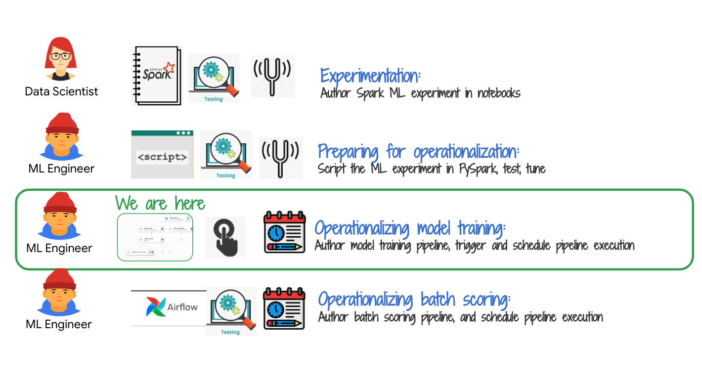

# About

In this module, we will author and test a Vertex AI pipeline to orchestrate the Spark ML model training and prepare for operationalizing the same. The module takes about an hour to complete.

## 1. Where we are in the model development lifecycle

   
  

## 2. The lab environment

   
  

## 3. The exercise

   
  

## 4. About authoring a Vertex AI pipeline 
We will use Vertex AI User Managed Notebook environment for this exercise and this is already created for you. When you open JupyterLab, you will also see a pre-created, customized notebook to get quick-started with learning pipeline authoring.

### 4.1. About Vertex AI pipelines

Vertex AI Pipelines helps you to automate, monitor, and govern your ML systems by orchestrating your ML workflow in a serverless manner, and storing your workflow's artifacts using Vertex ML Metadata. By storing the artifacts of your ML workflow in Vertex ML Metadata, you can analyze the lineage of your workflow's artifacts — for example, an ML model's lineage may include the training data, hyperparameters, and code that were used to create the model.

Watch this [short video on vertex AI pipelines](https://youtu.be/Jrh-QLrVCvM) and [read the documentation](https://cloud.google.com/vertex-ai/docs/pipelines/introduction).

### 4.2. What is supported/recommended for Spark ML models in Vertex AI from an MLOps perspective?

| # | Feature | Supported? |  Recommended Product/Service | Workaround | Nuances/Comments | 
| -- | :--- | :--- |:--- |:--- |:--- |
| 1 | Model training development environment and Spark infrastructure for development | Yes | Vertex AI Workbench Managed Notebook with Dataproc Serverless Spark Interactive sessions | | Preview as of 8/22|
| 2 | Model training orchestration  | Yes | Vertex AI Managed Pipelines | | Preview as of 8/22|
| 3 | Model training orchestration development | Yes | Vertex AI Workbench User-Managed Notebooks | | |
| 4 | Spark infrastructure for orchestrated model training  | Yes | Dataproc Serverless Spark Batches | | |

### 4.3. Taking a pipeline developed in a notebook to production - steps involved

## 5. Review and execute a Vertex AI pipeline from a notebook

## 6. Study the pipeline JSON

## 7. Test the JSON via Vertex AI pipeline UI

## 8. Edit the JSON for on-demand REST calls & persist in GCS

This concludes the module. In the [next module](../05-lab-guide/Module-06-Author-CloudFunction-For-Vertex-AI-Pipeline.md) you will create a Cloud Function to execute the Vertex AI Spark ML pipeline.

